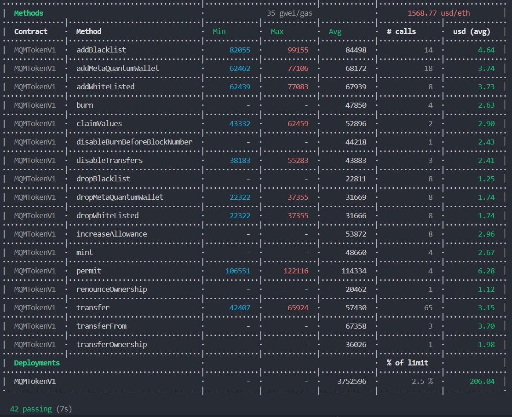
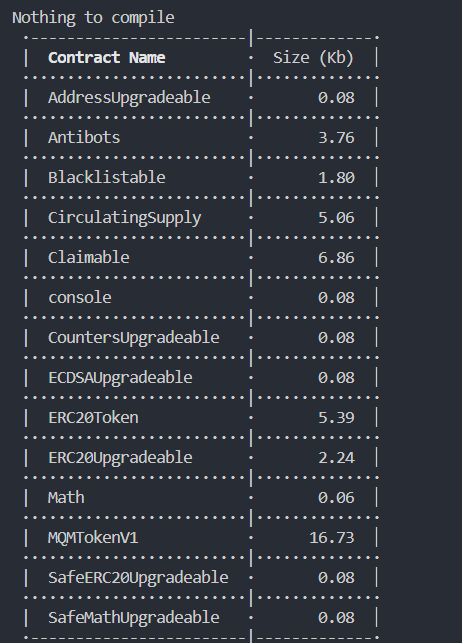

# Meta Quantum ERC20 Contracts V1

Before to Start

---

#### Validate Develop Environment

---
npm install  
npx hardhat compile     
npx hardhat run scripts/deploy.ts --network bsc_mainnet  
npx hardhat verify --network bsc_mainnet 0xae2ee2e674150226fafb91bb8fc488a7c333bdda

#BSC Testnet MQM Token
https://testnet.bscscan.com/address/0xC94090333FF8e30f3E1f5F4845f3dFa1aEdB24eD

#Polygon Mumbai MQM Token
https://mumbai.polygonscan.com/address/0x43fc56E296C39231368EF98210A06680568417a5


#Polygon and Chainlink
npx hardhat verify --network bsc_mainnet 0xF8235F6E27ba5D43Ac263932A710C76DE7F26B6E "0x747973a5A2a4Ae1D3a8fDF5479f1514F65Db9C31" "0x404460C6A5EdE2D891e8297795264fDe62ADBB75" "0xc251acd21ec4fb7f31bb8868288bfdbaeb4fbfec2df3735ddbd4f7dc8d60103c" "200000000000000000"

#### Start migration

---
```
npx hardhat run scripts/deploy.ts
```
OR
```
npm run deploy
```
---
#### Start Hardhat test
---

```
npx hardhat test
```
---
## environment variables (.env file)
---

- MNEMONIC=
- PRIVATE_KEY=
- COINMARKETCAP_API_KEY=
- ETHERSCAN_API_KEY=
- URL_MAINNET_ETH=
- URL_TESTNET_ETH=
- URL_MAINNET_POLYGON=
- URL_TESTNET_POLYGON=
- URL_MAINNET_BSC=https://bsc-dataseed1.binance.org
- URL_TESTNET_BSC=https://data-seed-prebsc-1-s1.binance.org:8545


---
### Audit Report

---


---
### Last ETH Gas Reporter

---

- Simulation for addAllocation() and transferMany() Methods based arrays of 100 addresses



---

### Last Contract Size Reporter

---


---

# MQM-token v1
